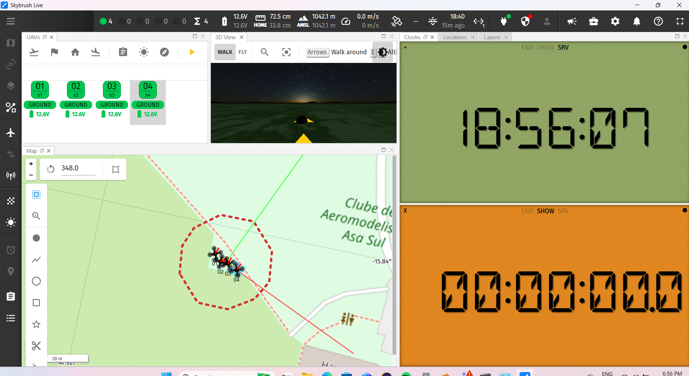
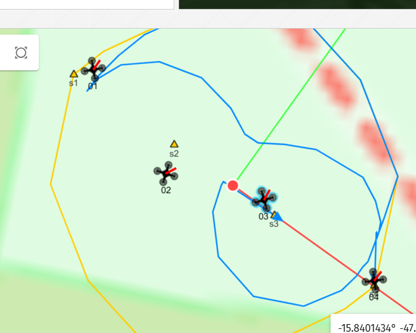
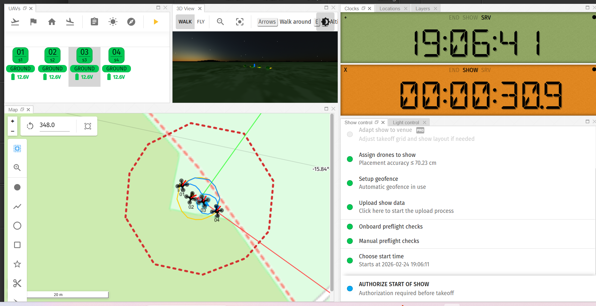
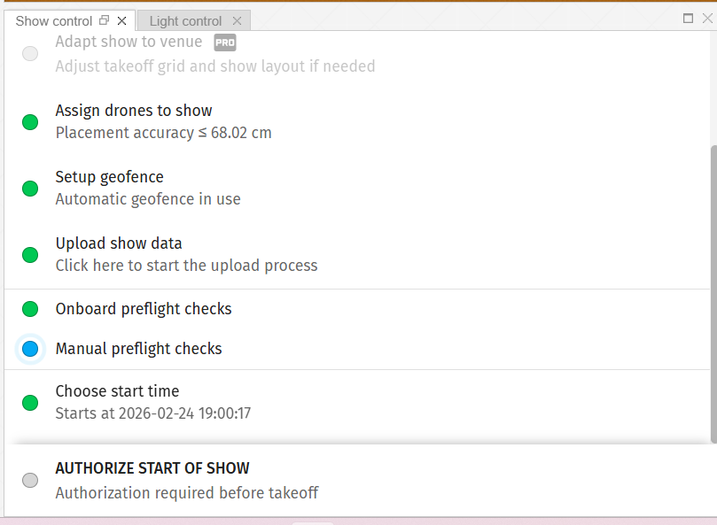
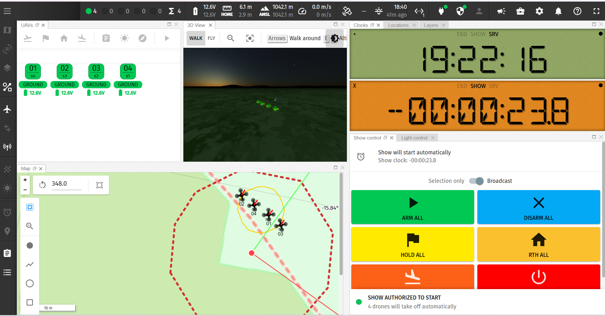

# 🚁 Skybrush — Testes de Drone Light Show · Brasília

Este repositório documenta os testes de voo realizados durante uma semana em Brasília utilizando o ecossistema **Skybrush** para criação e execução de drone light shows. Cada arquivo representa uma coreografia distinta, desenvolvida e validada em ambiente real.

---

## 📁 Estrutura da Pasta

```
skybrush/
├── imgs/
│   ├── 01_drones_ground.png
│   ├── 02_posicionamento.png
│   ├── 03_checklist_upload.png
│   ├── 04_checklist_completo.png
│   ├── 05_geofence_mapa.png
│   ├── 06_countdown_inicio.png
│   └── 07_countdown_15s.png
├── umDrone.blend
├── umDrone.skyc
├── doisDrone.blend
├── doisDrone.skyc
├── quatroDrone.blend
├── quatroDrone.skyc
├── LACdrones.blend
├── LACdrones.skyc
└── README.md
```

---

## 🎬 Descrição dos Shows

### `umDrone` — Quadrado Simples
Um único drone decola e percorre um trajeto em formato de **quadrado no céu**. Ideal para validar a precisão de trajetória e o comportamento do firmware em voos autônomos básicos.

---

### `doisDrone` — Círculos em Dois Eixos
Dois drones sobem simultaneamente e realizam movimentos circulares (**giratórios**) juntos: primeiro rodam no **eixo X**, em seguida ocorre uma rotação de eixo e os dois passam a rodar no **eixo Z**.

A coreografia demonstra controle de trajetórias curvilíneas com transição de eixo em tempo real.

---

### `quatroDrone` — Afastamento e Aproximação em Quadrado
Quatro drones sobem posicionados em **formato de quadrado**. A partir dessa formação, se **afastam** e depois se **aproximam** simetricamente, criando um efeito de pulsação visual.

> ⚠️ **Este show não foi validado em voo real.** A coreografia foi desenvolvida e testada apenas em ambiente de simulação.

---

### `LACdrones` — Escrita da Palavra LAC
Quatro drones formam a palavra **"LAC"** letra por letra no espaço:
- As letras **L**, **A** e **C** são desenhadas ao longo do **eixo X**
- Para evitar colisão, os drones operam em **dois planos distintos** (2 drones por plano)
- A palavra só é legível quando a **câmera está alinhada com o eixo X**

> ⚠️ A visualização correta depende do alinhamento da câmera com o eixo X no momento do show.

> ⚠️ **Este show não foi validado em voo real.** A coreografia foi desenvolvida e testada apenas em ambiente de simulação.

---

## 🛠️ Pré-requisitos de Software

Antes de executar qualquer show, certifique-se de ter os seguintes softwares instalados:

| Software | Função |
|---|---|
| **Skybrush Server** | Backend de comunicação com os drones |
| **Skybrush Live** | Interface de controle e execução do show |
| **Blender + Plugin Skybrush** *(recomendado)* | Edição e ajuste das animações `.blend` |
| **QGroundControl** | Diagnóstico de falhas no upload do arquivo `.skyc` |
| **Mission Planner** *(opcional)* | Referência de configuração MAVLink |

> 📖 Este guia foi elaborado com base no tutorial oficial:
> [Running a drone light show with ArduCopter and Skybrush — ArduPilot Discourse](https://discuss.ardupilot.org/t/running-a-drone-light-show-with-arducopter-and-skybrush/110023)

---

## ⚙️ Configuração dos Drones

1. **Firmware**: Todos os drones devem estar **flashados com o firmware do Skybrush** compatível com ArduCopter.

2. **Criação da pasta `shows`**:
   - Acesse o gerenciador de arquivos do drone (via conexão USB ou cartão SD)
   - Navegue até a pasta `APM/`
   - Crie uma subpasta chamada `shows`:
     ```
     APM/
     └── shows/
     ```
   > O upload do arquivo `.skyc` para esta pasta será realizado pelo **Skybrush Live** — não é necessário copiar o arquivo manualmente.

---

## 🌐 Configuração da Rede

A máquina que irá comandar o show deve estar **conectada à mesma rede Wi-Fi que os drones**.

Ao iniciar o Skybrush Server, as seguintes saídas confirmarão que o servidor está operacional:

```
http_server    Starting HTTP server on :5000
show           Default show start method: Show starts only with RC
show           Timecode synchronization suspends at T = -10 seconds
mavlink  mav   Routing primary traffic to mav
mavlink  mav   Routing RTK corrections to mav
mavlink  mav   Routing RC overrides to mav
mavlink  mav   Routing show control packets to mav
mavlink  mav   Connection at :14550 up and running
```

**Pontos importantes:**
- O servidor HTTP sobe na **porta 5000** da máquina de controle
- Os drones devem enviar a **chamada de conexão para a porta 14550** (padrão MAVLink / Mission Planner)
- Confirme que a conexão `14550` aparece como `up and running` antes de prosseguir

---

## 📡 Configuração do Skybrush Live

Com os drones conectados e o servidor rodando, abra o **Skybrush Live** e siga os passos abaixo:

### 1. Verificar Drones
- Confirme que **todos os drones aparecem** na interface
- Cada drone deve exibir a tag **`(GROUND)`**, indicando que estão no solo e conectados



### 2. Seleção do Arquivo de Show
- No Skybrush Live, selecione o arquivo `.skyc` correspondente ao show que será executado
- O Live irá realizar o upload do arquivo para a pasta `APM/shows/` de cada drone automaticamente

### 3. Posicionamento
- Insira as **coordenadas geográficas** próximas ao local do show
- Clique no ícone de **lápis mágico** para que os drones sejam automaticamente posicionados conforme sua localização GPS real
- Ajuste a **orientação do show** modificando o ângulo de referência conforme necessário




### 4. Precisão GPS (sem RTK)
Caso os drones não possuam **GPS RTK**, o Live pode travar o voo por critérios de segurança. Para contornar:
- Acesse **Configurações → UAVs**
- Role até a opção: **"Desired placement accuracy"**
- **Aumente o valor** da tolerância conforme necessário para liberar o voo

### 5. Designação e Geofence
- **Designe os drones** para o show correspondente
- Configure o **campo de segurança (geofence)** adequado para o local do voo

### 6. Upload do Show
- Faça o **upload do arquivo `.skyc`** via Skybrush Live
- Utilize o **QGroundControl** para identificar possíveis falhas ou erros no upload antes de prosseguir

### 7. Desativar Pré-flight Checks
- Desative os **Onboard Preflight Checks**
- Desative os **Manual Preflight Checks**

> ⚠️ Certifique-se de que o ambiente está seguro antes de desativar as checagens.



### 8. Iniciar o Show
- Selecione o **horário de início** do show
- Escolha a opção que **inicia o show sem controle remoto (RC)**
- Marque a **checkbox** para iniciar automaticamente no horário agendado

Quando o show estiver autorizado e o horário se aproximar, o contador entrará em contagem regressiva e os drones decolam automaticamente ao atingir T=0.


---

## ⚠️ Aviso: Parâmetros Modificados pelo Show

Ao executar um Skybrush show, **alguns parâmetros dos drones são automaticamente alterados** pelo firmware. Um exemplo importante é o parâmetro **`FENCE`**, que é **habilitado** durante o show para garantir a segurança da operação.

Caso não vá mais realizar shows e precise voar livremente, **revise e ajuste esses parâmetros manualmente** via Mission Planner ou QGroundControl antes de operar os drones em modo convencional. Não fazer isso pode resultar em comportamentos inesperados ou restrições de voo indesejadas.

---

*Documentação elaborada com base nos testes realizados em Brasília — Semana de Testes Skybrush*